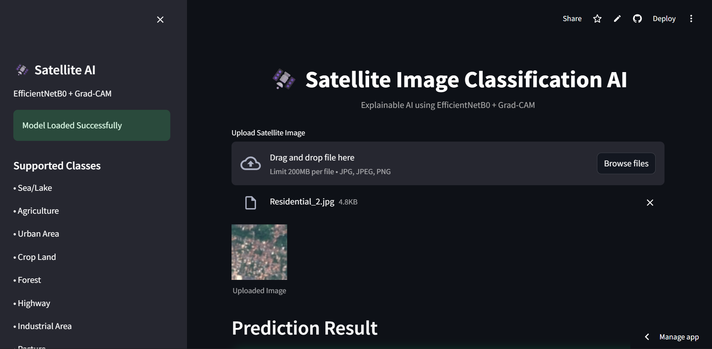

#Satellite Image Classification AI

An AI-powered satellite image classification system built using **TensorFlow**, **EfficientNetB0**, and **Streamlit** with **Explainable AI (Grad-CAM)** visualization.

This project classifies satellite images into multiple land-cover categories and visually explains the AI decision-making process using heatmaps.

---

#Live Demo

https://your-streamlit-link.streamlit.app

---

#Project Overview

Satellite imagery plays a major role in:

- Environmental monitoring
- Urban planning
- Agriculture analysis
- Disaster management
- Land-use classification

This project uses a Deep Learning model based on **EfficientNetB0 Transfer Learning** to classify satellite images into different terrain categories.

The system also includes **Grad-CAM Explainable AI**, which highlights the important regions of the image used by the model for prediction.

---

#Features

Upload satellite images  
Deep learning classification using EfficientNetB0  
Real-time prediction system  
Confidence score visualization  
Top-3 predictions display  
Explainable AI using Grad-CAM  
Heatmap attention visualization  
Interactive Streamlit web application  
Responsive dark-themed UI  
Multi-class land-cover detection  

---

#Supported Classes

The model can classify the following land categories:

| Class |
|------|
| Sea/Lake |
| Agriculture |
| Urban Area |
| Crop Land |
| Forest |
| Highway |
| Industrial Area |
| Pasture |
| River |
| Vegetation |
| Water Body |

---

#Tech Stack

## Programming Language
- Python

## Deep Learning Framework
- TensorFlow
- Keras

## Computer Vision
- OpenCV
- Pillow

## Web Framework
- Streamlit

## Data Processing
- NumPy

## Explainable AI
- Grad-CAM

---

#Deep Learning Model

## Model Used
- EfficientNetB0

## Transfer Learning
Pretrained ImageNet weights were used for better feature extraction and improved classification accuracy.

## Image Size
- 224 × 224

## Framework
- TensorFlow / Keras

---

#Explainable AI (Grad-CAM)

The project integrates **Grad-CAM (Gradient-weighted Class Activation Mapping)** to visualize:

- Which image regions influenced predictions
- AI attention areas
- Important land features

This improves:
- Model transparency
- Interpretability
- User trust

---

#Screenshots

#Home Page

---

##Prediction Result

---

##Grad-CAM Visualization

Installation Guide
1️⃣ Clone Repository
git clone https://github.com/yourusername/satellite-image-classifier.git

2️⃣ Move Into Project Directory
cd satellite-image-classifier

3️⃣ Create Virtual Environment (Optional)
Windows
python -m venv venv
venv\Scripts\activate

Linux / Mac
python3 -m venv venv
source venv/bin/activate

4️⃣ Install Dependencies
pip install -r requirements.txt

5️⃣ Run Streamlit Application
streamlit run app.py

Project Structure
satellite-image-classifier/
│
├── app.py
├── requirements.txt
├── best_satellite_model.keras
├── README.md
│
├── screenshots/
│   ├── home.png
│   ├── prediction.png
│   └── gradcam.png
│
└── assets/

Workflow
Step 1

User uploads satellite image

⬇

Step 2

Image preprocessing performed

⬇

Step 3

EfficientNetB0 extracts deep features

⬇

Step 4

AI predicts land-cover category

⬇

Step 5

Confidence scores generated

⬇

Step 6

Grad-CAM heatmap visualization displayed

Prediction Output
The application displays:

1.Predicted class
2.Confidence percentage
3.Top-3 predictions
4.Grad-CAM heatmap
5.AI attention overlay

Future Improvements
Planned future enhancements:

1.Multiple image upload
2.Batch prediction system
3.Download prediction report
4.Mobile responsive design
5.Interactive analytics dashboard
6.Model accuracy graphs
7.API deployment using FastAPI
8.Docker containerization
9.Cloud deployment on AWS/GCP
10.Real-time satellite feed integration

Learning Outcomes
This project helped in understanding:

Transfer Learning
CNN Architectures
EfficientNet
Explainable AI
TensorFlow Deployment
Streamlit App Development
Computer Vision
Deep Learning Model Deployment

Author
Shubh Raj

AI & Machine Learning Enthusiast 🚀

Connect With Me
GitHub: https://github.com/shubhangiraj24-star
